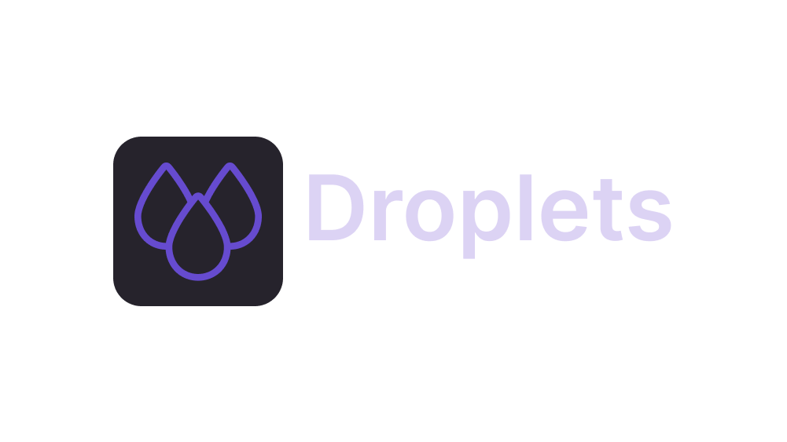

Droplets is a web application that allows you to interact with the API of Puroto. This is the front-end of [Puroto](https://puroto.net).

Track its progress toward for the closed alpha [here](https://github.com/PurotoApp/Droplets/milestone/1).

## Contributing

We highly appreciate all kinds of contributions to Droplets. For learning more about contributing to Droplets in an open source matter, please see our [contribution guidelines](https://github.com/PurotoApp/Droplets/blob/master/.github/CONTRIBUTING.md) for more informations.

## Building Droplets locally

### Prerequisites

- Latest version of [Node.js](https://nodejs.org/)
- Latest version of [git](https://git-scm.com/)
- Latest version of [npm](https://www.npmjs.com/)

### Compiling

1. Open a terminal and clone this repository using git.
   ```
   git clone https://github.com/PurotoApp/Droplets.git
   ```
2. cd into the repository folder and install the dependencies.
   ```
   cd Droplets
   npm install
   ```
3. Run the application.
   ```
   npm run dev
   ```

---

###### Made and maintained with ❤ by PurotoApp and its community.

###### Copyright (c) 2022 PurotoApp under the GPLv3 license.